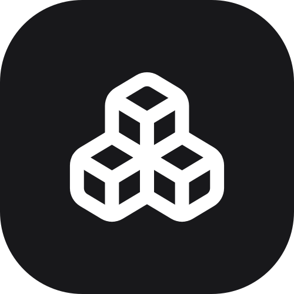

<p align="center">
  
</p>

<h1 align="center">MatrixLab</h1>

<p align="center">
  <strong>Açık kaynak, serverless atölye ve laboratuvar envanter yönetim sistemi.</strong>
</p>

<p align="center">
  <a href="https://github.com/pxsty0/matrixlab/blob/main/LICENSE">
    
  </a>
  
  
  
  
  
  
</p>

---

## MatrixLab Nedir?

**MatrixLab**, atölye ve laboratuvar ortamlarındaki fiziksel malzemeleri **Dolap → Raf / Bölme → Ürün** hiyerarşisiyle yöneten, **DataMatrix (ISO/IEC 16022)** 2D barcode etiketleme ve kamera scanner desteğine sahip modern bir envanter yönetim sistemidir.

Tamamen **serverless** mimariyle kurgulanmıştır; dedicated server kiralama, veritabanı bakımı veya altyapı maliyeti gerektirmez. Firebase Spark Plan (ücretsiz katman) ile sıfır maliyetle deploy edilebilir ve çalıştırılabilir.

### Hedef Kitle ve Kullanım Alanları

| Hedef Kitle                            | Kullanım Senaryoları                                                             |
| -------------------------------------- | -------------------------------------------------------------------------------- |
| 🎓 **Üniversite Laboratuvarları**      | Elektronik komponent, test & ölçüm aletleri ve Ar-Ge malzemesi envanter yönetimi |
| 🔧 **Makerspace & Atölyeler**          | El aletleri, sarf malzeme ve yedek parça envanter yönetimi                       |
| 🤖 **Robotik & Mühendislik Kulüpleri** | Takım malzeme zimmetleme, raf transferleri ve anlık stok kontrolü                |
| 🏫 **Teknoloji Atölyeleri**            | Ortak kullanılan ekipman ve malzeme kutularının düzeni                           |

---

## Öne Çıkan Özellikler

### Hiyerarşik Depolama Düzeni

Fiziksel depolama düzeninizi dijital ortama birebir aktarın:

```text
Dolap (D-01)
 └── Raf / Bölme (D-01-R1)
      ├── 📦 Arduino Uno R3 (×12)
      └── 📦 Breadboard 830 Pin (×30)
```

### DataMatrix 2D Etiketleme (ISO/IEC 16022)

- Her dolap, raf ve ürün için anında standart DataMatrix 2D barcode üretimi
- Termal veya standart yazıcılarla uyumlu, özel CSS baskı motoru (LabelHub)
- Barcode üzerinde tip rozeti, okunabilir kod ve malzeme detay gösterimi

### Dahili Kamera ve Web Scanner

- Web kamerası veya mobil cihaz kamerasıyla doğrudan barcode tarama
- Taranan DataMatrix kodunu çözümleyerek ilgili ürün, raf veya dolap sayfasına anında yönlendirme
- Mobil cihazlarda donanım seviyesinde kamera API entegrasyonu

### Rol Tabanlı Yetkilendirme (RBAC)

| Rol       | Yetkiler                                                                            |
| --------- | ----------------------------------------------------------------------------------- |
| **Admin** | Tüm CRUD yetkileri, kullanıcı oluşturma/düzenleme, rol atama ve sistem yönetimi     |
| **Staff** | Malzeme, dolap ve raf yönetimi, stok giriş/çıkış, raf transferi ve zimmet işlemleri |
| **User**  | Yalnızca kendi profil bilgilerini görüntüleme (onay bekleyen kayıtlar)              |

### Atomic Firestore Transaction İşlemleri

- Stok artırma/azaltma ve raflar arası transfer işlemleri `runTransaction` mekanizması ile atomic olarak yürütülür
- Race condition ve negatif stok oluşumu veritabanı seviyesinde engellenir

### Zimmetleme ve Malzeme Atama

- Malzemeleri kullanıcılara veya ekip üyelerine başlangıç/bitiş tarihiyle zimmetleme
- İletişim bilgisi, adet ve not kaydı tutma
- Zimmet durumunun ürün detayında ve listelerde anlık rozetlerle takibi

### Değiştirilemez Audit Log Kayıtları

- Gerçekleştirilen tüm CRUD, stok değişimi, transfer ve oturum hareketleri anlık loglanır
- Firestore security rules ile log kayıtları **immutable** kılınmıştır, sonradan silinemez ve güncellenemez (`allow update, delete: if false`)

---

## Teknoloji Yığını (Tech Stack)

| Katman                 | Teknoloji                                                          | Açıklama                                          |
| ---------------------- | ------------------------------------------------------------------ | ------------------------------------------------- |
| **Frontend Framework** | [Next.js 15](https://nextjs.org/) + [React 19](https://react.dev/) | Hızlı, tip güvenli SPA mimarisi (Static Export)   |
| **Programlama Dili**   | [TypeScript 6](https://www.typescriptlang.org/)                    | Strict mode, uçtan uca tip güvenliği              |
| **CSS & Stil**         | [Tailwind CSS 4](https://tailwindcss.com/)                         | Modern CSS-first derleme (`@tailwindcss/postcss`) |
| **İkon Seti**          | [Lucide React](https://lucide.dev/)                                | Minimalist ve tutarlı SVG arayüz ikonları         |
| **Veritabanı**         | [Cloud Firestore](https://firebase.google.com/docs/firestore)      | Gerçek zamanlı NoSQL veritabanı                   |
| **Kimlik Doğrulama**   | [Firebase Auth](https://firebase.google.com/docs/auth)             | E-posta ve şifre tabanlı oturum yönetimi          |
| **Barcode Motoru**     | [bwip-js](https://github.com/metafloor/bwip-js)                    | ISO/IEC 16022 DataMatrix barkod üretimi           |
| **Scanner Motoru**     | [html5-qrcode](https://github.com/mebjas/html5-qrcode)             | Tarayıcı ve mobil kamera barkod okuyucu           |
| **Mobil Çatı**         | [Capacitor 8](https://capacitorjs.com/)                            | iOS ve Android native paketleme altyapısı         |

---

## Kurulum ve Başlangıç

### Ön Gereksinimler

- [Node.js](https://nodejs.org/) (v18 veya üzeri)
- [npm](https://www.npmjs.com/) / [yarn](https://yarnpkg.com/) / [pnpm](https://pnpm.io/)
- [Firebase Hesabı](https://console.firebase.google.com/) (Ücretsiz Spark planı yeterlidir)

### 1. Repoyu Klonlayın

```bash
git clone https://github.com/pxsty0/matrixlab.git
cd matrixlab
```

### 2. Bağımlılıkları Yükleyin

```bash
npm install
```

### 3. Firebase Projesini Yapılandırın

1. [Firebase Console](https://console.firebase.google.com/) üzerinden yeni bir proje oluşturun.
2. **Build** menüsü altından şu servisleri aktifleştirin:
   - **Authentication** ➔ Sign-in method ➔ **Email/Password**
   - **Firestore Database** ➔ Üretim (Production) modunda başlatın
3. **Project Settings ➔ General ➔ Your apps** bölümünden bir Web Uygulaması ekleyin.

### 4. Environment Değişkenlerini Tanımlayın

`.env.example` dosyasını kopyalayarak `.env` dosyanızı oluşturun:

```bash
cp .env.example .env
```

Firebase konsolundan aldığınız anahtarları `.env` içerisine yerleştirin:

```env
NEXT_PUBLIC_FIREBASE_API_KEY=AIzaSy...
NEXT_PUBLIC_FIREBASE_AUTH_DOMAIN=your-project.firebaseapp.com
NEXT_PUBLIC_FIREBASE_PROJECT_ID=your-project-id
NEXT_PUBLIC_FIREBASE_STORAGE_BUCKET=your-project.appspot.com
NEXT_PUBLIC_FIREBASE_MESSAGING_SENDER_ID=1234567890
NEXT_PUBLIC_FIREBASE_APP_ID=1:1234567890:web:abcdef
```

### 5. Firestore Security Rules Yayınlayın

```bash
firebase deploy --only firestore:rules
```

### 6. Geliştirme Sunucusunu Başlatın

```bash
npm run dev
```

Tarayıcınızda `http://localhost:3000` adresine gidin.

### 7. İlk Admin Kullanıcıyı Tanımlama

1. Giriş ekranındaki **Kayıt Ol** sekmesinden ilk hesabınızı oluşturun.
2. [Firebase Console](https://console.firebase.google.com/) ➔ **Firestore Database** ➔ `users` koleksiyonuna gidin.
3. Kendi kullanıcınızı bulun ve `role` alanını `"user"` yerine `"admin"` olarak güncelleyin.
4. Sayfayı yenilediğinizde tam yetkili admin paneline erişebilirsiniz.

---

## Mobil Uygulama Derleme (Capacitor)

MatrixLab, Capacitor 8 altyapısıyla tek kod tabanı üzerinden iOS ve Android native uygulaması olarak derlenebilir.

### 1. Platformları Ekleyin

```bash
npx cap add ios
npx cap add android
```

### 2. Build ve Sync

```bash
npm run cap:sync
```

### 3. Kamera İzinlerini Ekleyin

DataMatrix tarama modülü için cihaz kamera izni gereklidir:

#### iOS (`ios/App/App/Info.plist`)

```xml
<key>NSCameraUsageDescription</key>
<string>DataMatrix barkod taramak için kamera erişimi gereklidir.</string>
```

#### Android (`android/app/src/main/AndroidManifest.xml`)

```xml
<uses-permission android:name="android.permission.CAMERA" />
```

### 4. Yerel IDE'lerde Başlatın

```bash
# iOS (Xcode)
npm run cap:open:ios

# Android (Android Studio)
npm run cap:open:android
```

---

## Katkıda Bulunma

MatrixLab açık kaynak bir projedir ve topluluk katkılarına açıktır!

1. Projeyi **Fork** edin.
2. Yeni bir özellik için **Branch** açın (`git checkout -b feature/yeni-ozellik`).
3. Değişikliklerinizi **Commit**'leyin (`git commit -m 'feat: yeni özellik eklendi'`).
4. Dalınızı uzak sunucuya **Push** edin (`git push origin feature/yeni-ozellik`).
5. Bir **Pull Request** oluşturun.

---

## Lisans

Bu proje [MIT Lisansı](LICENSE) altında açık kaynak olarak sunulmaktadır. [Mustafa KÖK](https://github.com/pxsty0) tarafından geliştirilmiştir.
